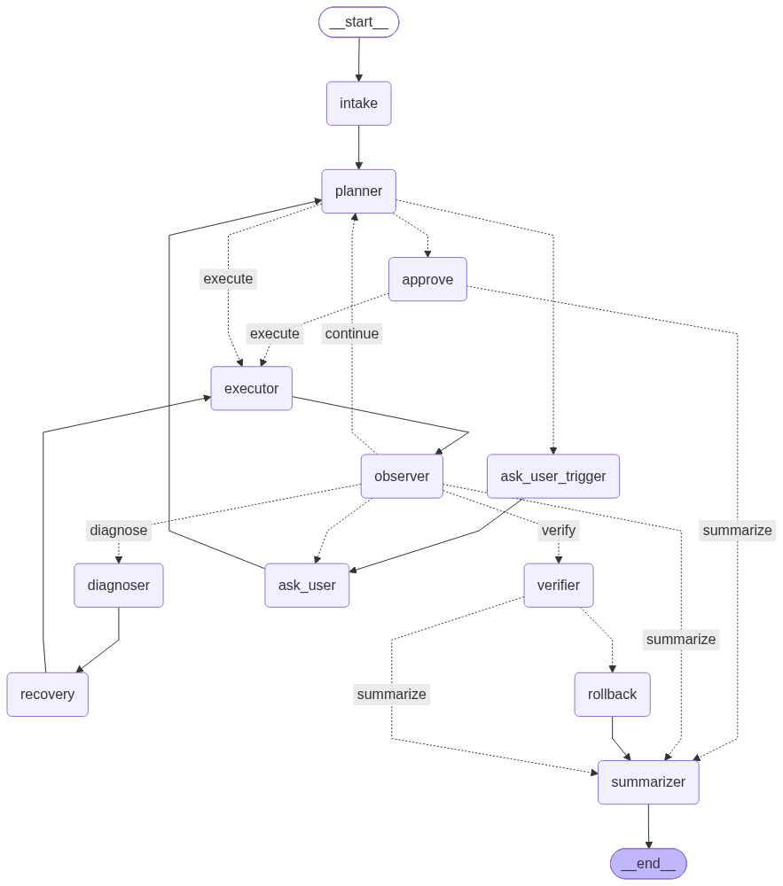

# AI Worker — Autonomous Task Execution

An autonomous AI agent that takes natural-language tasks and completes them end-to-end using a browser, files, and APIs, with memory, failure recovery, verification, and human-in-the-loop approval.

## Workflow



Each run goes through `intake → planner → executor → observer`, then a router sends it to the diagnoser/recovery loop on failure, the verifier/rollback path after writes, or the summarizer when done. Risky or ambiguous actions pause for human approval.

## Setup

**Prerequisites:** Python 3.10+, a Groq API key, and optionally a LangSmith key.

```bash
git clone <your-repo-url>
cd ai-worker

python -m venv venv
source venv/bin/activate          # Windows: venv\Scripts\activate

pip install -r requirements.txt
playwright install chromium

python -m mock_env.api.seed       # seed the mock database
```

Create a `.env` file in the project root:

```bash
GROQ_API_KEY=your_groq_key_here
LANGCHAIN_TRACING_V2=true
LANGCHAIN_API_KEY=your_langsmith_key_here
LANGCHAIN_PROJECT=ai-worker
```

## Run

**Terminal 1** — start the mock company server (must stay running on `localhost:8000`):

```bash
uvicorn mock_env.api.main:app --port 8000
```

**Terminal 2** — run the agent:

```bash
python -m agent.run "your task here"
```

When the agent pauses for approval, type `approve` or `reject` in the CLI. Each run writes a structured report to `reports/<thread_id>.json`.

## Example Tasks

```bash
# Simple lookup
python -m agent.run "Fetch vendor V001 from the API and tell me their email"

# Multi-step with verification
python -m agent.run "Read invoices/acme_inv_001.txt, open /app/erp, fill the form with the invoice data, and click submit"

# Human approval (high-value action)
python -m agent.run "Use the API to create invoice INV-900 for V001 with amount 250000"

# Clarification (ambiguous input)
python -m agent.run "Find the Acme vendor's email"

# Failure recovery
python -m agent.run "Read invoices/does_not_exist.txt"
```

## Project Structure

```text
ai-worker/
├── agent/
│   ├── graph.py        # LangGraph definition
│   ├── run.py          # CLI entry point
│   ├── state.py        # AgentState
│   ├── report.py       # FinalReport schema
│   ├── nodes/          # graph nodes
│   ├── tools/          # file, browser, API, memory tools
│   ├── memory/         # world model, recovery memory
│   └── policies/       # risk assessor
├── mock_env/           # FastAPI + SQLite + HTML pages + mock files
├── reports/            # JSON report per run
├── workflow.png
└── requirements.txt
```

## Tech Stack

LangGraph · ChatGroq (openai/gpt-oss-20b) · Playwright · FastAPI + SQLite · ChromaDB · Pydantic v2 · LangSmith

## Known Limitations

- CLI only, no streaming UI
- Single-user, one-shot tasks
- Documents truncated at 4000 chars
- No retry on planner JSON errors
- Mock API has no auth

## Assumptions

- Mock environment runs on `localhost:8000`
- Evaluator provides their own Groq API key
- No real credentials are used; everything runs locally

## Submission

- Demo video: (link)
- LangSmith Trace Example: [View Trace](https://smith.langchain.com/public/03218293-ebab-4026-86f5-7f51b43aa3a3/r/01a12128-c839-7d53-8bb7-8d2b159c05df?start_time=2026-10-09T14%3A54%3A43.257431Z)