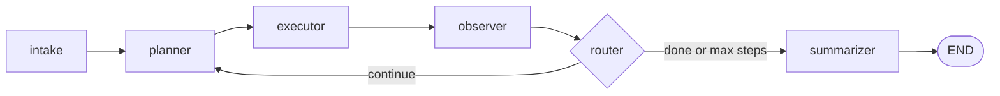

# 🤖 AI Worker

**An autonomous agent that turns a plain-English task into completed work, using a browser, files, and APIs, and then checks that the work actually got done.**


> **Example task:** *"Find the latest invoice from Acme Corp, extract the amount and due date, enter it into our ERP, and confirm once done."*
>
> The agent reads the file, extracts the fields, fills in the ERP form in a real browser, submits it, and confirms the result through the API.

---

## Table of Contents

- [Why this project](#why-this-project)
- [Status](#status)
- [Quick start](#quick-start)
- [Example tasks](#example-tasks)
- [How it works](#how-it-works)
- [Tools](#tools)
- [Mock company environment](#mock-company-environment)
- [Chaos engineering](#chaos-engineering)
- [Project structure](#project-structure)
- [Design decisions](#design-decisions)
- [Known limitations](#known-limitations)
- [Roadmap](#roadmap)
- [Tech stack](#tech-stack)
- [Assumptions](#assumptions)

---

## Why this project

Many office tasks follow the same pattern: read some information, decide what to do, use one or more apps, and check the result. A person usually has to move between tools by hand to finish even a simple request.

This prototype shows an AI worker that can:

1. Take a task in natural language and work out the goal without step-by-step instructions.
2. Choose its next action, run it with a real tool (browser, REST API, file system), and observe the result.
3. Detect failures, retry, and recover.
4. Verify that the requested outcome was actually achieved.
5. Ask a human for clarification or approval when it can't proceed safely.
6. Return a concise summary with evidence.

**What is real and what is simulated:** the *agent*, its tools, and the browser automation are real. The *company* it works inside (ERP, CRM, invoices, vendors) is a local mock environment, so failures can be injected safely and repeatably. No real credentials are used anywhere.

---

## Status

Work in progress, built in phases.

| Phase | Description | Status |
|:-----:|-------------|:------:|
| 0 | Repo scaffolding, first LangGraph, LLM setup | ✅ Done |
| 1 | Mock company environment (FastAPI, SQLite, HTML, files, chaos controller) | ✅ Done |
| 2 | Core agent loop (intake → planner → executor → observer → router → summarizer) | ✅ Done |
| 3 | Full tool set (browser, files, APIs) and LLM-based extractor | ✅ Done |
| 4 | Memory and world model (typed entities, cross-step facts) | ⏳ In progress |
| 5 | Failure detection and recovery (taxonomy, diagnoser, recovery memory) | 🗓 Planned |
| 6 | Verification and rollback | 🗓 Planned |
| 7 | Human approval and clarification | 🗓 Planned |
| 8 | Summarizer and evidence collection | 🗓 Planned |
| 9 | Generalization across task types | 🗓 Planned |
| 10 | Chaos evaluation harness and metrics | 🗓 Planned |
| 11 | UI, demo video, final documentation | 🗓 Planned |

---

## Quick start

### Prerequisites

- Python 3.10+
- A [Groq API key](https://console.groq.com)
- A [LangSmith API key](https://smith.langchain.com) (optional, but strongly recommended for tracing)

### 1. Install

```bash
git clone <your-repo-url>
cd ai-worker

python -m venv venv
source venv/bin/activate          # Windows: venv\Scripts\activate

pip install -r requirements.txt
playwright install chromium
```

### 2. Configure environment variables

Copy `.env.example` to `.env` and fill in your keys:

```bash
GROQ_API_KEY=your_groq_key_here

# Optional: tracing
LANGCHAIN_TRACING_V2=true
LANGCHAIN_API_KEY=your_langsmith_key_here
LANGCHAIN_PROJECT=ai-worker
```

### 3. Seed the mock database

```bash
python -m mock_env.api.seed
```

This creates `mock_env/company.db` with sample vendors, purchase orders, and employees.

### 4. Start the mock company server

```bash
uvicorn mock_env.api.main:app --port 8000
```

Check that it's running:

```bash
curl http://localhost:8000/api/health
# {"status": "ok"}
```

| URL | What it is |
|-----|------------|
| http://localhost:8000/docs | Interactive API docs |
| http://localhost:8000/app/erp | Invoice entry form |
| http://localhost:8000/app/crm | Vendor list and search |

### 5. Run the agent

In a second terminal:

```bash
python -m agent.run "your task here"
```

Every run produces a LangSmith trace showing each prompt, LLM response, and tool call.

---

## Example tasks

Tasks are listed from simple to complex. All of them work with the current Phase 3 tool set.

```bash
# Files only
python -m agent.run "List all files in the invoices folder"

# Read and extract
python -m agent.run "Read invoices/acme_inv_001.txt and tell me the amount and vendor"

# Browser navigation
python -m agent.run "Open /app/erp and tell me the page title"

# API call
python -m agent.run "Fetch vendor V001 from the API and tell me their email"

# Full pipeline: file → browser form → API check
python -m agent.run "Read invoices/acme_inv_001.txt, open the ERP at /app/erp, fill the form with the invoice data, submit, and verify via API"
```

---

## How it works

The agent is a ReAct-style loop built as a LangGraph state machine. The planner picks **one action at a time**, the executor runs it, and the observer records what happened before the next decision.



All nodes read from and write to a shared `AgentState` (task, goal, next action, last observation, history, world model, status, and so on).

### Nodes

| Node | Responsibility |
|------|----------------|
| `intake` | Turns the user's task into a one-sentence goal |
| `planner` | Asks the LLM for the single next action (JSON) |
| `executor` | Runs the chosen tool, catches every error, returns a uniform result |
| `observer` | Updates the world model, extracts facts, appends to history |
| `router` | Conditional edge: keep looping or move to the summary |
| `summarizer` | Produces the final report |

---

## Tools

The executor dispatches to a registry of tools. Every tool returns the same shape:

```python
{"success": bool, "result": dict, "error": str | None}
```

| Category | Tools |
|----------|-------|
| Files | `list_files`, `read_file` |
| Browser (Playwright) | `browser_open`, `browser_fill`, `browser_click`, `browser_read`, `browser_screenshot` |
| API (httpx) | `api_get`, `api_post`, `api_get_invoice`, `api_create_invoice`, `api_get_vendor`, `api_get_po` |

The agent touches the mock company **only through these tools**. It has no direct database access.

---

## Mock company environment

A simulated company runs next to the agent.

- **Backend:** FastAPI + SQLite (`mock_env/api/`)
- **Web apps:** Jinja2 HTML pages for browser automation (`mock_env/web/templates/`)
- **Documents:** sample files to read (`mock_env/files/`)
- **Chaos controller:** on-demand failure injection (`mock_env/chaos.py`)

### Entities

Vendors (with aliases), purchase orders, invoices (the main work item), employees, expense reports (Phase 9), and payments.

### Seeded edge cases

| Case | What it tests |
|------|---------------|
| `acme_inv_002.txt` has no due date | Missing-field handling |
| V001 "Acme Corp" and V003 "Acme Corporation" both exist | Ambiguity resolution |
| Creating a duplicate invoice ID returns `409` | Duplicate detection |

### Web pages and selectors

| Page | Selectors |
|------|-----------|
| `/app/erp` | `#invoice_id`, `#vendor_id`, `#amount`, `#due_date`, `#po_number`, `#submit-btn` |
| `/app/crm` | `#search-input`, `#search-btn`, `#vendor-list` |

Selectors are stable for now on purpose. Phase 5 will rename them through chaos to force the agent to recover.

---

## Chaos engineering

`mock_env/chaos.py` injects failures at runtime without changing any application code. This underpins Phase 5 (recovery) and Phase 10 (evaluation).

| Chaos | Effect |
|-------|--------|
| `api_500_on` | Force an endpoint to return 500 |
| `timeout_on` | Force an endpoint to hang |
| `selector_override` | Rename a DOM selector on a given page |
| `missing_field` | Omit a field from file reads |
| `duplicate_invoice` | Force the duplicate-invoice error |
| `ambiguous_vendor` | Force two vendors with the same name |

```bash
# Make the invoices endpoint fail
curl -X POST http://localhost:8000/api/chaos/set \
     -H "Content-Type: application/json" \
     -d '{"api_500_on": "/api/invoices"}'

# Rename the ERP submit button's selector
curl -X POST http://localhost:8000/api/chaos/set \
     -H "Content-Type: application/json" \
     -d '{"selector_override": {"erp": {"#submit-btn": "#submit-button"}}}'

# Reset everything
curl -X POST http://localhost:8000/api/chaos/reset
```

---

## Project structure

```text
ai-worker/
├── agent/
│   ├── state.py                # AgentState TypedDict
│   ├── llm.py                  # Shared ChatGroq instance
│   ├── graph.py                # LangGraph definition
│   ├── run.py                  # CLI entry point
│   ├── nodes/
│   │   ├── intake.py           # Task → goal
│   │   ├── planner.py          # Decide next action
│   │   ├── executor.py         # Run the tool
│   │   ├── observer.py         # Update world model
│   │   ├── router.py           # Conditional edge
│   │   └── summarizer.py       # Final report
│   ├── tools/
│   │   ├── registry.py         # Tool dict + descriptions
│   │   ├── files.py            # File read/list
│   │   ├── browser.py          # Playwright tools
│   │   ├── browser_session.py  # Persistent browser singleton
│   │   └── api.py              # HTTP tools
│   ├── memory/
│   │   └── extractor.py        # LLM-based field extraction
│   └── policies/               # (Phase 5+) policy rules
├── mock_env/
│   ├── api/
│   │   ├── main.py             # FastAPI app
│   │   ├── database.py         # SQLAlchemy setup
│   │   ├── models.py           # ORM models
│   │   ├── schemas.py          # Pydantic schemas
│   │   ├── routes_api.py       # JSON endpoints
│   │   ├── routes_web.py       # HTML pages
│   │   └── seed.py             # Seed script
│   ├── web/templates/          # Jinja2 HTML
│   ├── files/                  # Mock documents
│   └── chaos.py                # Chaos controller
├── ui/                         # (Phase 11) Streamlit UI
├── eval/                       # (Phase 10) Evaluation harness
├── requirements.txt
├── .env.example
└── README.md
```

---

## Design decisions

<details>
<summary><b>1. Manual tool calling instead of <code>@tool</code> + <code>bind_tools</code></b></summary>

The planner asks the LLM for JSON, and the code parses and dispatches it. Tool descriptions live in a plain string (`TOOL_DESCRIPTIONS`).

- **Transparency:** every prompt and response is visible in LangSmith, with no framework magic.
- **Extensibility:** the planner can emit extra fields such as `reason`, `confidence`, or `approval_required`.
- **Failure handling:** malformed JSON doesn't crash the agent, so it can retry or recover.
- **Model independence:** works with any LLM that can output JSON.
- **Control signals:** `DONE`, `ASK_USER`, and `REQUEST_APPROVAL` are not tools, and fit naturally here.

Moving to native tool calling for production would be straightforward. This trade-off is deliberate.
</details>

<details>
<summary><b>2. LangGraph instead of a plain while loop</b></summary>

- Conditional edges make routing explicit and testable.
- Checkpointing (planned) lets the agent pause for human approval.
- Each node is isolated and easy to test.
- The graph doubles as architecture documentation.
</details>

<details>
<summary><b>3. One step at a time, not a full plan upfront</b></summary>

Real websites change, and the agent can't know what step 2 looks like until step 1 is done. A plan made upfront goes stale. Deciding one action at a time is what makes this an agent rather than a fixed workflow.
</details>

<details>
<summary><b>4. Uniform tool interface</b></summary>

Every tool returns `{"success", "result", "error"}`. The observer and the future diagnoser can handle any tool's output without special cases.
</details>

<details>
<summary><b>5. Defensive execution</b></summary>

The executor never lets a tool exception escape. Every error becomes a normal observation the agent can react to. The planner also handles malformed JSON without crashing the graph.
</details>

<details>
<summary><b>6. LLM-based extraction over regex</b></summary>

Invoice formats vary a lot (`Amount: 45000` vs `Total: ₹45,000.00`, `2026-10-15` vs `Oct 15, 2026`). Regex breaks on these. The LLM extractor handles them at the cost of speed and tokens. In production, try regex first and fall back to the LLM.
</details>

<details>
<summary><b>7. Persistent browser session (singleton)</b></summary>

Playwright tools share one browser across a run, so `browser_fill` doesn't start from a blank page. The trade-off is that all runs in one Python process share state. For clean eval runs, call `BrowserSession.get().stop()` between runs (Phase 10).
</details>

<details>
<summary><b>8. <code>page_name</code> as a chaos seam</b></summary>

Browser tools take a `page_name` (`"erp"`, `"crm"`). The chaos controller uses it to override selectors per page. The agent never knows chaos exists, which is the basis of the Phase 5 reliability story.
</details>

<details>
<summary><b>9. Max steps as a safety valve</b></summary>

State carries `max_steps=15`, and the router stops the loop when it's reached, so a confused agent can't run forever.
</details>

---

## Known limitations

- **No verification yet.** The agent assumes an action worked. Phase 6 adds read-back verification and rollback.
- **No structured recovery yet.** If a tool fails, the planner may retry or give up. Phase 5 adds a failure taxonomy and recovery memory.
- **No human-in-the-loop yet.** Phase 7 adds interrupt-based approval and clarification.
- **No planner retry on bad JSON.** The planner gives up if the LLM returns malformed output. Phase 5 adds retry with prompt correction.
- **Browser session is process-scoped.** Fine for demos, needs isolation for evaluation.
- **Extractor truncates at 4000 characters.** Long documents are only partly parsed.
- **No streaming.** The CLI prints after the run finishes. The Streamlit UI (Phase 11) will stream step by step.
- **No auth on the mock API.** Acceptable for a sandbox, not for production.

---

## Roadmap

| Phase | Planned work |
|:-----:|--------------|
| 4 | Typed world model, cross-step facts, scratchpad memory, session persistence |
| 5 | Failure taxonomy, diagnoser node, recovery memory |
| 6 | Verification node, read-back comparison, rollback of partial writes |
| 7 | Risk-aware approval via LangGraph interrupt, clarification flows |
| 8 | Evidence collection (screenshots, API responses, file paths) and structured summary |
| 9 | More task types (expense reports, vendor onboarding, research and compilation) on the same loop |
| 10 | Chaos evaluation: 50 injected scenarios, success and recovery rates, cost and latency metrics |
| 11 | Streamlit UI, demo video, final docs |

---

## Tech stack

| Layer | Choice | Why |
|-------|--------|-----|
| LLM | Groq (`llama-3.3-70b-versatile`) | Fast, cheap, reliable JSON output |
| Orchestration | LangGraph | Stateful, cyclic graphs with checkpointing |
| Tracing | LangSmith | Full visibility into every prompt and tool call |
| Browser | Playwright | Reliable, fast, strong DOM control |
| API | FastAPI | Quick to write, automatic docs, Pydantic validation |
| ORM / DB | SQLAlchemy + SQLite | Zero setup for a prototype |
| Templating | Jinja2 | Server-rendered pages for browser automation |
| HTTP client | httpx | Simple client for calling the mock backend |
| Validation | Pydantic v2 | Request and response schemas |

---

## Assumptions

- The mock environment runs at `http://localhost:8000`, and all tools assume this.
- The evaluator has a Groq API key.
- The agent is single-user and single-session.
- Tasks are one-shot, with no long-running background jobs.
- No real credentials are used anywhere.
- Playwright's Chromium is installed with `playwright install chromium`.

---

## Submission

- **GitHub:** _link to be added_
- **Demo video:** _link to be added_
- **LangSmith project:** _link to be added_

## License

For evaluation purposes only.